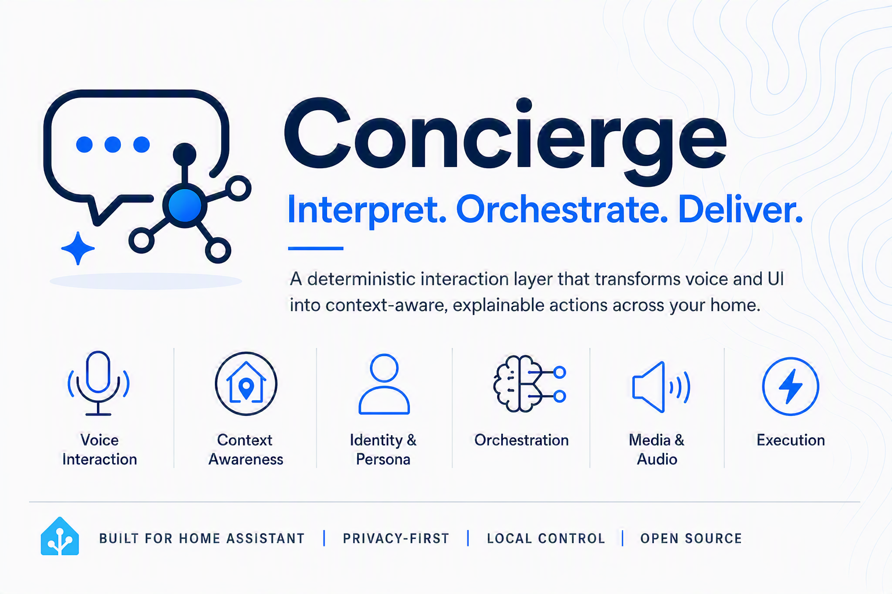
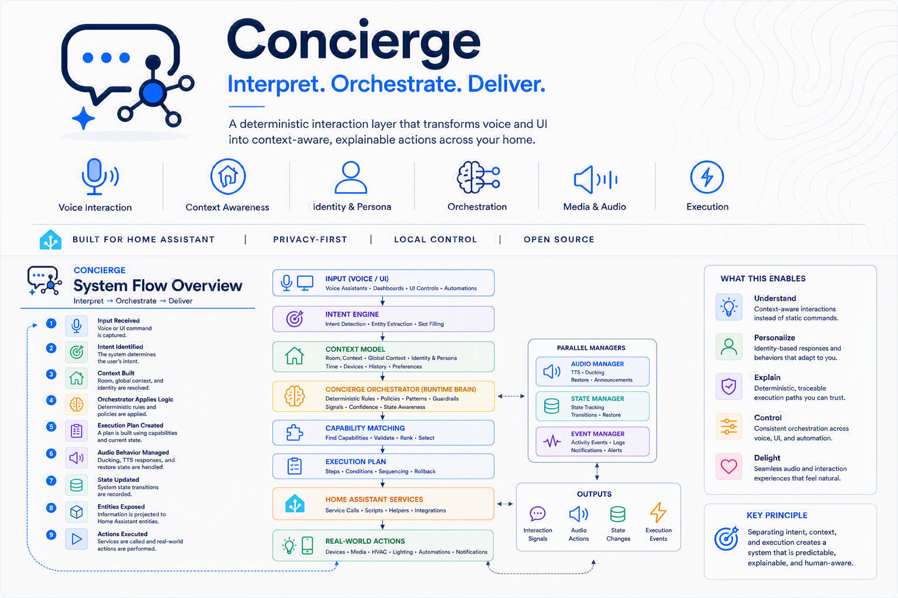

## How It Works


# Concierge

Concierge is the Household Coordination Engine for the Homes That Behave Well platform.
Concierge consumes governed context from platform authorities and produces deterministic, explainable, room-aware household coordination behavior.

## Release Status

- Product documentation version: v1.0.0
- Concierge core governed implementation status: complete
- Phase 3 governed implementation status: complete
- Post-install enhancement track: active (including Follow-Me media continuity classification)

This README describes what Concierge does today.

## What Concierge Does Today

Concierge currently provides:

- Deterministic orchestration for configured household targets
- Calm, person-scoped messaging and delivery routing
- Household productivity context consumption and synthesis surfaces
- Provenance-oriented activity timeline and archive export surfaces
- Diagnostics and repair visibility for operational explainability

## Post-Install Enhancements

Concierge continues to evolve through bounded post-install enhancements that preserve HTBW authority and consumer constraints.

Current enhancement focus includes Follow-Me media continuity classification and decision explainability for room-transition handoff behavior.

Follow-Me is explicitly separate from both room-aware playback and merged-room playback.

## Platform Responsibility Model

Homes That Behave Well separates platform responsibility across services.

```text
Foundation
    What is true?

Asset Intelligence
    What matters?

Voice Identity
    Who is interacting?

Concierge
    What should happen?
```

Concierge does not define system truth.

Concierge consumes governed outputs and coordinates household behavior.

## Coordination Boundaries

Concierge is a bounded consumer and orchestrator.

Concierge does not replace authority owned by other services:

- Identity and attribution authority stays with Voice Identity
- Asset significance and asset authority stays with Asset Intelligence
- Calendar, email, tasks, shopping, and external provider truth stay with source systems
- Architecture authority stays with Homes That Behave Well ADRs, contracts, and models

## Capability Snapshot

### 1) Deterministic Execution and Resolution

- Executes configured targets through governed orchestration
- Supports explicit direct execution when requested
- Preserves deterministic routing and explainable outcome posture

### 2) Room and Composite Context

- Coordinates by room-first household context
- Supports merged and composite room behavior
- Supports room and structure synchronization with Home Assistant area state
- Supports governed media continuity with explicit Follow-Me classification boundaries

### 3) Person and Identity Context Consumption

- Consumes person profile and identity context
- Applies policy-aware person controls and bounded consent posture
- Preserves fail-closed behavior for unavailable or low-confidence attribution paths
- Treats `conversation_id`, `device_id`, and `satellite_id` as correlation context only, not identity authority
- Consumes short-lived Voice Identity attribution context generated while audio is available

### 4) Voice Enrollment Lifecycle Surfaces

- Supports explicit enrollment start, sample capture, sample removal, profile build, reset, and delete
- Supports governed lifecycle controls such as completion-readiness and lifecycle recovery/cancel/resume patterns
- Preserves local-first and bounded authority posture during enrollment orchestration

### 5) Messaging and Delivery Coordination

- Supports person-scoped message delivery routing
- Supports mobile, UI, and room delivery pathways through configured targets
- Preserves consent, privacy, visibility, and explainability boundaries

### 6) Productivity and Household Awareness Consumption

- Consumes configured productivity source references
- Supports calendar, email, tasks, shopping, capture, knowledge, and household synthesis visibility surfaces
- Preserves source-of-record boundaries for external provider systems

### 7) Provenance and Explainability Surfaces

- Supports activity event recording and activity outcome closure
- Supports timeline query and archive export
- Supports diagnostics visibility aligned to bounded governance ownership
- Exposes media continuity and Follow-Me decision fields for runtime explainability

## Follow-Me and Media Continuity Boundaries

- Follow-Me requires policy-authorized identity and room-transition context.
- Follow-Me does not override merged-room grouping behavior.
- Manual stop and cooldown protections can block handoff by design.
- Destination room playback targets must be configured and available.

## Runtime Voice Attribution Boundary

- Voice Identity performs attribution while audio is available.
- Voice Identity owns short-lived runtime attribution context lifecycle.
- Concierge consumes safe attribution context and applies authorization classification.
- Home Assistant text-only conversation-trigger automation paths are fallback/debug paths and are not identity-authoritative.

## Home Assistant Service Surface

Concierge exposes a broad Home Assistant service API, including:

- Orchestration and direct execution services
- Room/composite configuration and synchronization services
- Person, identity, and voice profile services
- Voice enrollment lifecycle services
- Activity timeline and archive services
- Mobile context resolution and person messaging services

Service definitions are available in:

- custom_components/concierge/services.yaml

## Typical Operator Workflows

### Coordinate a household action

1. Configure room/composite and person context.
2. Call Concierge orchestration service for a target.
3. Review deterministic execution outcome and explainability fields.

### Validate person-aware behavior

1. Ensure person profile and identity context are configured.
2. Run summary or execution path.
3. Confirm attribution and person-context behavior is fail-closed when required.

### Review household activity provenance

1. Query activity timeline for a window/person/area/channel.
2. Export activity archive for historical or governance review.

### Maintain room and entity structure

1. Sync rooms with Home Assistant areas.
2. Refresh entity structure surfaces after topology changes.

## Quick Start (Development)

Install dependencies:

```bash
pip install -r requirements-dev.txt
```

Run tests:

```bash
pytest -q
```

## Release and Quality Expectations

Concierge release expectations include:

- Home Assistant integration validation
- HACS validation
- Governance and ownership boundary review
- Diagnostics and operational readiness review
- Traceable implementation evidence for governed scope

## Repository Highlights

Core integration surfaces are in:

```text
custom_components/concierge/
    services.py
    services.yaml
    coordinator.py
    diagnostics.py
    repairs.py
    config_flow.py
    storage.py
    enrollment_*.py
    voice_identity_bridge.py
```

Governance and implementation evidence are in:

```text
docs/governance/
    phase-2/
    phase-3/
```

## Documentation Scope

This README is the product truth and operational overview for Concierge v1.0.0.

Deeper architecture, configuration guides, and user manual content are intended for the Concierge Wiki.

For Follow-Me implementation and boundaries, see:

- [Follow-Me media guide](docs/governance/experience-continuity/follow-me-media-guide.md)
- [Follow-Me limitations and boundaries](docs/governance/experience-continuity/follow-me-limitations-and-boundaries.md)
- [Wiki: Follow-Me media](docs/wiki/follow-me-media.md)
- [Wiki: Services reference](docs/wiki/services-reference.md)
- [Wiki: Troubleshooting](docs/wiki/troubleshooting.md)

## Learn More

Platform and repository documentation:

```text
/docs/architecture/
/docs/contracts/
/docs/models/
/docs/governance/
/docs/wiki/
/docs/patterns/
/docs/philosophy/
```

Concierge is part of the Homes That Behave Well platform.
