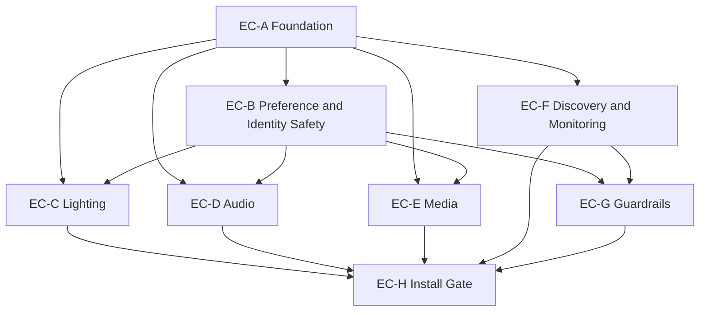

# Experience Continuity Epic and Issue Roadmap

## 1. Executive Summary
This artifact converts the approved Experience Continuity governance chain into a dependency-ordered epic and issue roadmap for Concierge V2 execution.

The roadmap is architecture-governed, requirement-traceable, and install-gate oriented.

This roadmap does not implement code, does not change production Home Assistant, and does not alter runtime behavior.

Concierge V2 install-readiness remains NOT_READY until roadmap issues are implemented and validated.

## 2. Source Artifacts Used
Authority order applied:
1. docs/governance/experience-continuity/adr-experience-continuity-architecture.md
2. docs/governance/experience-continuity/experience-continuity-scope-decisions.md
3. docs/governance/experience-continuity/experience-continuity-requirements-backlog.md
4. docs/governance/experience-continuity/v1-to-v2-capability-parity-matrix.md
5. docs/governance/experience-continuity/v1-capability-reconstruction.md
6. Concierge V2 docs/contracts/implementation/tests
7. homes_that_behave_well contracts/models
8. voice_identity contracts/implementation
9. asset_intelligence contracts/implementation
10. GitHub repository conventions
11. Inference only where explicitly labeled

## 3. Roadmap Methodology
- Start from approved EC requirements (EC-REQ-001 through EC-REQ-092 as defined in backlog authority).
- Group requirements into coherent implementation slices, not one issue per requirement.
- Preserve architecture boundaries from ADR and scope decisions.
- Order issues by dependency readiness, not domain preference.
- Separate install-gate required work from supporting and post-install work.
- Preserve out-of-scope decisions from scope authority.

## 4. Requirement Grouping Strategy
Grouping rationale:
- Shared models/policies first, domain behaviors second, validation closure last.
- Each issue is reviewable and testable as an outcome-oriented increment.
- Cross-domain guardrails are centralized to avoid drift.
- Tests/docs are explicit closure work items per domain and at install-gate level.

## 4A. State Scope Boundary Model (Architectural Ownership)
This boundary model is an architectural ownership guide, not an implementation schema.

Entity-scoped:
- learned light/lamp brightness
- learned light/lamp color temperature, where supported
- learned light/lamp color/effect, where supported

Room-scoped:
- room music volume
- room duck volume
- room TTS volume
- room last song
- room last genre played
- room media context
- configured room speakers/output

Person-scoped:
- preferred artist
- preferred genre
- preferred album
- preferred playlist
- music affinity/play something I like

Household-scoped:
- guest defaults
- unknown-speaker defaults
- unavailable-identity fallback
- silence-is-success policy
- capability-not-available policy

Post-install/future composition:
- BLE/presence-based Follow-Me Music
- cross-room media transfer
- person preference plus current room speaker composition

## 4B. Playback Scope vs Memory Scope
Playback scope determines which speakers participate in an active audio event.

Memory scope determines where continuity state is persisted.

Merged-room rule:
- merged rooms expand playback scope.
- merged rooms do not automatically merge memory scope.
- merged-room playback is shared; constituent-room continuity memory remains independent.

Target issue count: 28 detailed issues.
Reasoning: this keeps implementation coherent across eight epics while preserving validation and documentation closure quality without splitting into 92 micro-issues.

## 5. Epic List
- EC-A: Experience Continuity Foundation
- EC-B: Preference Resolution and Identity Safety
- EC-C: Lighting Continuity
- EC-D: Audio Continuity and Sonos Speech
- EC-E: Media Continuity
- EC-F: Room Capability Awareness and Monitoring Follow-Ups
- EC-G: Guardrails, Failure Handling, and Silence-Is-Success
- EC-H: Production Install Gate and Validation

## 6. Dependency Graph

## 7. Execution Order
1. EC-A-01 Runtime model and terminology
2. EC-A-02 Continuity scope and event classification
3. EC-A-03 State strategy and helper disposition policy implementation plan
4. EC-A-04 Continuity diagnostics and traceability scaffolding
5. EC-B-01 Preference resolution hierarchy
6. EC-B-02 Identity confidence and guest fail-closed policy
7. EC-B-03 Learning permission boundaries
8. EC-F-01 Room capability awareness from room configuration
9. EC-C-01 Learned/usual lighting resolution
10. EC-C-02 Room-aware lamp/light actuation parity
11. EC-C-03 Lighting fallback/no-capability behavior
12. EC-C-04 Lighting tests and documentation
13. EC-D-01 Room audio preference resolution
14. EC-D-02 Sonos speech duck/restore lifecycle
15. EC-D-03 Audio fallback/no-speaker behavior
16. EC-D-04 Audio tests and documentation
17. EC-E-01 Room-level music playback resolution
18. EC-E-02 Room-level continue/resume media
19. EC-E-03 Room-level last-media context
20. EC-E-04 Manual-stop cooldown/no unwanted auto-start
21. EC-E-05 Media tests and documentation
22. EC-F-02 Monitoring follow-up answers from configured room capabilities
23. EC-F-03 Capability-not-available graceful refusal
24. EC-G-01 Silence-is-success and direct-refusal policy
25. EC-G-02 Degraded-path guardrail validation suite
26. EC-H-01 Install-gate evidence package
27. EC-H-02 Final readiness checklist and closure decision
28. EC-PE-01 Cross-room follow-me media enhancement (post-install only)

## 8. Detailed Issue Drafts

### Issue EC-A-01: Create Experience Continuity Runtime Model and Terminology
Epic: EC-A

## Purpose
Establish the shared runtime terminology and model primitives required by all downstream continuity domains.

## Source Evidence
- docs/governance/experience-continuity/adr-experience-continuity-architecture.md
- docs/governance/experience-continuity/experience-continuity-requirements-backlog.md
- docs/governance/experience-continuity/v1-to-v2-capability-parity-matrix.md

## Requirement Coverage
- EC-REQ-001
- EC-REQ-010
- EC-REQ-011

## Scope
Define runtime concepts for experience snapshot, usual state, operational restore, preference restore, continuity confidence, and continuity event identity.

## Non-Goals
- No domain-specific lighting/audio/media implementation.
- No production HA config change.

## Architecture / Design Guidance
Use ADR-defined concept boundaries and keep ownership alignment with Foundation/Voice Identity/Asset Intelligence.

## Dependencies
None.

## Implementation Areas To Inspect
- custom_components/concierge/models.py
- custom_components/concierge/services.py
- custom_components/concierge/storage.py
- docs/governance/experience-continuity/adr-experience-continuity-architecture.md

## Acceptance Criteria
- Runtime concept taxonomy is codified and referenced by downstream issues.
- Model terms map cleanly to continuity policy definitions.
- No ownership boundary violations introduced.

## Tests Required
- Unit tests validating model serialization/validation of continuity concepts.

## Documentation Required
- Update continuity domain terminology in governance docs and operator-facing architecture notes.

## Install Gate Impact
INSTALL_GATE_REQUIRED

## Validation Evidence Required
- Model cross-reference artifact linking concepts to install-gate behaviors.

## Labels / Classification
- INSTALL_GATE_REQUIRED
- concierge changes: yes
- Foundation changes: no
- Voice Identity changes: no
- Asset Intelligence changes: no
- Home Assistant production config changes: no
- documentation only: no

## Execution Order Notes
Must be first implementation issue.

### Issue EC-A-02: Implement Continuity Scope and Event Classification
Epic: EC-A

## Purpose
Define and enforce continuity scope boundaries and event classes needed for deterministic continuity behavior.

## Source Evidence
- docs/governance/experience-continuity/adr-experience-continuity-architecture.md
- docs/governance/experience-continuity/experience-continuity-requirements-backlog.md

## Requirement Coverage
- EC-REQ-012
- EC-REQ-092

## Scope
Classify events and scope contexts across entity, room, person, household, and mode.

## Non-Goals
- No preference outcomes.
- No direct device orchestration.

## Architecture / Design Guidance
Classification must support diagnostics and traceability without coupling to implementation-specific helper schemas.

## Dependencies
- EC-A-01

## Implementation Areas To Inspect
- custom_components/concierge/services.py
- custom_components/concierge/coordinator.py
- custom_components/concierge/diagnostics.py
- tests/test_diagnostics.py

## Acceptance Criteria
- Event and scope classification is deterministic for required continuity flows.
- Traceability signals can be emitted for install-gate verification.

## Tests Required
- Unit tests for event classification and scope resolution.

## Documentation Required
- Scope/event classification reference with examples.

## Install Gate Impact
INSTALL_GATE_SUPPORTING

## Validation Evidence Required
- Diagnostics samples showing classified events and scopes.

## Labels / Classification
- INSTALL_GATE_SUPPORTING
- concierge changes: yes
- Foundation changes: no
- Voice Identity changes: no
- Asset Intelligence changes: no
- Home Assistant production config changes: no
- documentation only: no

## Execution Order Notes
Start immediately after EC-A-01.

### Issue EC-A-03: Define V1 Helper-Backed State Disposition and V2 State Strategy
Epic: EC-A

## Purpose
Convert V1 helper-backed state families to governed V2 disposition strategy for migrate/seed/re-learn/replace/retire.

## Source Evidence
- docs/governance/experience-continuity/experience-continuity-scope-decisions.md
- docs/governance/experience-continuity/v1-capability-reconstruction.md
- docs/governance/experience-continuity/experience-continuity-requirements-backlog.md

## Requirement Coverage
- EC-REQ-082
- EC-REQ-083

## Scope
Create complete disposition mapping for each helper-backed family referenced by in-scope continuity outcomes.

## Non-Goals
- No one-to-one schema preservation.
- No out-of-scope routine migration.

## Architecture / Design Guidance
State strategy must remain schema-independent and align to room/person continuity models.

## Dependencies
- EC-A-01

## Implementation Areas To Inspect
- docs/governance/experience-continuity/v1-capability-reconstruction.md
- custom_components/concierge/storage.py
- homes_that_behave_well/docs/models/experience-restoration-context-model.md

## Acceptance Criteria
- Every relevant helper family has one disposition category.
- No requirement assumes direct helper schema clone.

## Tests Required
- Validation test for disposition mapping completeness and consistency.

## Documentation Required
- Helper-family disposition matrix.

## Install Gate Impact
INSTALL_GATE_REQUIRED

## Validation Evidence Required
- Published mapping artifact with reviewer sign-off.

## Labels / Classification
- INSTALL_GATE_REQUIRED
- concierge changes: yes
- Foundation changes: maybe
- Voice Identity changes: no
- Asset Intelligence changes: no
- Home Assistant production config changes: no
- documentation only: no

## Execution Order Notes
Complete before domain-level stateful continuity implementation.

### Issue EC-A-04: Add Continuity Diagnostics and Explainability Scaffolding
Epic: EC-A

## Purpose
Provide diagnostics needed to verify continuity decisions and policy alignment without violating ownership boundaries.

## Source Evidence
- docs/governance/experience-continuity/adr-experience-continuity-architecture.md
- docs/governance/experience-continuity/experience-continuity-requirements-backlog.md

## Requirement Coverage
- EC-REQ-092

## Scope
Add diagnostics shape for continuity decisions, policy branch outcomes, and fallback reasons.

## Non-Goals
- No direct end-user behavior change.

## Architecture / Design Guidance
Diagnostics must expose decision trace, not duplicate source-of-truth ownership domains.

## Dependencies
- EC-A-01
- EC-A-02

## Implementation Areas To Inspect
- custom_components/concierge/diagnostics.py
- custom_components/concierge/services.py
- tests/test_diagnostics.py

## Acceptance Criteria
- Decision traces are available for install-gate evidence collection.
- Trace outputs redact or avoid private/raw owner internals.

## Tests Required
- Diagnostics tests for trace completeness and boundary safety.

## Documentation Required
- Diagnostics field reference for continuity validation.

## Install Gate Impact
INSTALL_GATE_SUPPORTING

## Validation Evidence Required
- Diagnostics samples tied to install-gate scenarios.

## Labels / Classification
- INSTALL_GATE_SUPPORTING
- concierge changes: yes
- Foundation changes: no
- Voice Identity changes: no
- Asset Intelligence changes: no
- Home Assistant production config changes: no
- documentation only: no

## Execution Order Notes
Must complete before EC-H evidence packaging.

### Issue EC-B-01: Implement Preference Resolution Hierarchy
Epic: EC-B

## Purpose
Implement governed continuity preference precedence from command intent through safe default.

## Source Evidence
- docs/governance/experience-continuity/adr-experience-continuity-architecture.md
- docs/governance/experience-continuity/experience-continuity-requirements-backlog.md

## Requirement Coverage
- EC-REQ-070
- EC-REQ-071
- EC-REQ-072

## Scope
Add shared resolver logic for continuity decisions used by lighting/audio/media/monitoring behavior.

For music preference behavior, person-scoped preferences are the default model (preferred artist/genre/album/playlist and music affinity).

Room-level media continuity context remains room-scoped and is consumed separately from person preference.

## Non-Goals
- No direct domain feature closure in this issue.
- Do not model preferred artist, preferred genre, preferred album, or preferred playlist as person+room by default.
- Do not store room last-media context as a person preference.
- Do not treat room media history as a substitute for person music preference.
- Do not implement Follow-Me Music in this issue.

## Architecture / Design Guidance
Resolver order must be explicit and auditable: command, guardrail, known person preference, optional explicit person+room exception, room default, household default, system safe default.

Music preference boundary:
- person-scoped preferences are portable across rooms by default.
- person+room music preferences are exception-only, not baseline behavior.
- identity confidence and guest/unknown policy gates determine whether person preference can be applied.

## Dependencies
- EC-A-01
- EC-A-02

## Implementation Areas To Inspect
- custom_components/concierge/services.py
- custom_components/concierge/models.py
- tests/test_services.py

## Acceptance Criteria
- Resolver produces deterministic outcomes across required contexts.
- Guardrails always take precedence over personalization.
- Person-scoped music preference resolution is explicit and distinct from room-scoped media continuity state.
- Guest/unknown/low-confidence contexts do not apply person-specific music preferences.

## Tests Required
- Resolver unit tests for precedence and conflict scenarios.
- Scope-boundary tests proving person-scoped preference data is not treated as room-scoped last-media context.
- Identity-context tests proving personalized preference branches only activate in policy-allowed confidence states.

## Documentation Required
- Preference hierarchy contract documentation.

## Install Gate Impact
INSTALL_GATE_REQUIRED

## Validation Evidence Required
- Trace logs proving hierarchy branch resolution in scenario suite.

## Labels / Classification
- INSTALL_GATE_REQUIRED
- concierge changes: yes
- Foundation changes: maybe
- Voice Identity changes: maybe
- Asset Intelligence changes: no
- Home Assistant production config changes: no
- documentation only: no

## Execution Order Notes
Must complete before domain personalization work.

### Issue EC-B-02: Implement Identity Confidence and Guest Default Policy
Epic: EC-B

## Purpose
Enforce fail-closed personalization and guest/unknown/low-confidence defaults for continuity behavior.

## Source Evidence
- docs/governance/experience-continuity/adr-experience-continuity-architecture.md
- docs/governance/experience-continuity/experience-continuity-scope-decisions.md
- docs/governance/experience-continuity/experience-continuity-requirements-backlog.md

## Requirement Coverage
- EC-REQ-060
- EC-REQ-061

## Scope
Apply policy outcomes for known high-confidence identity, unknown identity, low-confidence identity, guest mode, and unavailable Voice Identity.

## Non-Goals
- No domain-specific media/lighting behavior in this issue.

## Architecture / Design Guidance
Identity signals are consumed from Voice Identity; Concierge must not own identity scoring.

## Dependencies
- EC-B-01

## Implementation Areas To Inspect
- custom_components/concierge/services.py
- tests/test_foundation.py
- tests/test_services.py
- ../voice_identity/custom_components/voice_identity/services.py

## Acceptance Criteria
- Personalization is blocked in fail-closed contexts.
- Room/household defaults are available under degraded identity confidence.

## Tests Required
- End-to-end tests for guest, unknown, low-confidence, and unavailable identity contexts.

## Documentation Required
- Identity safety policy and context matrix.

## Install Gate Impact
INSTALL_GATE_REQUIRED

## Validation Evidence Required
- Test evidence proving fail-closed behavior and safe fallback continuity outcomes.

## Labels / Classification
- INSTALL_GATE_REQUIRED
- concierge changes: yes
- Foundation changes: no
- Voice Identity changes: maybe
- Asset Intelligence changes: no
- Home Assistant production config changes: no
- documentation only: no

## Execution Order Notes
Blocks personalized continuity in C, D, E.

### Issue EC-B-03: Implement Learning Permission Boundaries and Non-Blocking Policy
Epic: EC-B

## Purpose
Apply governed learning boundaries and non-blocking behavior for continuity learning paths.

## Source Evidence
- docs/governance/experience-continuity/adr-experience-continuity-architecture.md
- docs/governance/experience-continuity/experience-continuity-requirements-backlog.md

## Requirement Coverage
- EC-REQ-080
- EC-REQ-081

## Scope
Implement rules for where learning can commit, where it must be suppressed, and how it remains explainable/reversible.

## Non-Goals
- No final domain-specific learning optimization.

## Architecture / Design Guidance
Learning must not block interaction flow and must respect identity/guest safety constraints.

## Dependencies
- EC-B-01
- EC-B-02
- EC-A-03

## Implementation Areas To Inspect
- custom_components/concierge/services.py
- custom_components/concierge/storage.py
- tests/test_services.py

## Acceptance Criteria
- Learning commits are policy-compliant by identity context.
- Learning pipelines are asynchronous and non-blocking.

## Tests Required
- Tests for learning allow/deny outcomes and asynchronous completion behavior.

## Documentation Required
- Learning governance and reversibility notes.

## Install Gate Impact
INSTALL_GATE_REQUIRED

## Validation Evidence Required
- Policy tests and learning trace artifacts.

## Labels / Classification
- INSTALL_GATE_REQUIRED
- concierge changes: yes
- Foundation changes: maybe
- Voice Identity changes: maybe
- Asset Intelligence changes: no
- Home Assistant production config changes: no
- documentation only: no

## Execution Order Notes
Must complete before confidence-sensitive domain learning features.

### Issue EC-C-01: Implement Learned/Usual Lighting Resolution
Epic: EC-C

## Purpose
Preserve learned or usual lighting user outcomes for room-aware lamps and lights commands.

## Source Evidence
- docs/governance/experience-continuity/v1-capability-reconstruction.md
- docs/governance/experience-continuity/v1-to-v2-capability-parity-matrix.md
- docs/governance/experience-continuity/experience-continuity-requirements-backlog.md

## Requirement Coverage
- EC-REQ-020
- EC-REQ-023

## Scope
Capture stable light and lamp levels as learned usual levels and apply learned usual levels during room-aware turn on lamps and turn on lights outcomes.

## Non-Goals
- No one-to-one V1 helper schema copy.
- Do not infer all room lamps/lights dynamically when room configuration has defined membership.
- Do not implement scene-based restoration as a substitute for learned usual lighting.
- Do not require person-specific lighting preferences for initial parity unless explicitly required by install-gate policy.

## Architecture / Design Guidance
Preserve outcome parity for V1 turn_on_lamps_usual_room and turn_on_lights_usual_room while using Room Configuration authored room membership and Experience Continuity state models.

## Dependencies
- EC-A-01
- EC-A-03
- EC-B-01
- EC-B-02

## Implementation Areas To Inspect
- custom_components/concierge/services.py
- custom_components/concierge/storage.py
- tests/test_services.py
- docs/governance/experience-continuity/v1-capability-reconstruction.md

## Acceptance Criteria
- Stable light/lamp level can be learned as usual after the governed stability interval.
- Turn on lamps applies stored usual lamp levels for configured room lamp membership.
- Turn on lights applies stored usual light levels for configured room light membership.
- Missing stored usual level falls back safely.
- Usual-state restore and operational snapshot restore remain explicitly distinct and testable.

## Tests Required
- Scenario tests for usual restore and operational restore distinction.

## Documentation Required
- Lighting continuity resolution behavior contract.

## Install Gate Impact
INSTALL_GATE_REQUIRED

## Validation Evidence Required
- Test scenarios demonstrating preserved V1 outcome class.

## Labels / Classification
- INSTALL_GATE_REQUIRED
- concierge changes: yes
- Foundation changes: maybe
- Voice Identity changes: maybe
- Asset Intelligence changes: no
- Home Assistant production config changes: no
- documentation only: no

## Execution Order Notes
Starts EC-C domain implementation.

### Issue EC-C-02: Implement Room-Aware Lamp/Light Actuation Parity
Epic: EC-C

## Purpose
Provide room-aware lamp/light actuation parity for in-scope voice/follow-up continuity outcomes.

## Source Evidence
- docs/governance/experience-continuity/v1-capability-reconstruction.md
- docs/governance/experience-continuity/v1-to-v2-capability-parity-matrix.md
- docs/governance/experience-continuity/experience-continuity-requirements-backlog.md

## Requirement Coverage
- EC-REQ-021

## Scope
Implement room-aware command behavior for lamps/lights and related in-scope command outcomes.

## Non-Goals
- No out-of-scope routines.

## Architecture / Design Guidance
Behavior must be deterministic across known room and degraded room contexts.

## Dependencies
- EC-C-01
- EC-F-01

## Implementation Areas To Inspect
- custom_components/concierge/services.py
- custom_components/concierge/services.yaml
- tests/test_services.py

## Acceptance Criteria
- Room-aware lamp/light commands execute with expected continuity behavior.
- Behavior aligns with continuity scope and preference hierarchy.

## Tests Required
- Tests for known-room, no-room, and ambiguous-room command behavior.

## Documentation Required
- Room-aware lighting command behavior notes.

## Install Gate Impact
INSTALL_GATE_REQUIRED

## Validation Evidence Required
- Command parity scenarios mapped to V1 outcome classes.

## Labels / Classification
- INSTALL_GATE_REQUIRED
- concierge changes: yes
- Foundation changes: maybe
- Voice Identity changes: no
- Asset Intelligence changes: no
- Home Assistant production config changes: no
- documentation only: no

## Execution Order Notes
Depends on room capability awareness baseline and core lighting resolution.

### Issue EC-C-03: Implement Lighting Fallback and No-Capability Behavior
Epic: EC-C

## Purpose
Implement safe fallback behavior for unsupported/missing lighting capabilities.

## Source Evidence
- docs/governance/experience-continuity/adr-experience-continuity-architecture.md
- docs/governance/experience-continuity/experience-continuity-requirements-backlog.md

## Requirement Coverage
- EC-REQ-022
- EC-REQ-063

## Scope
Handle no-light/no-lamp contexts, unsupported color/color-temperature restore, and deterministic default behavior.

## Non-Goals
- No new user-facing capabilities beyond in-scope gate outcomes.

## Architecture / Design Guidance
Fallback should be calm and deterministic; where explicit refusal is required, integrate with guardrail/refusal issue.

## Dependencies
- EC-C-02
- EC-G-01

## Implementation Areas To Inspect
- custom_components/concierge/services.py
- tests/test_services.py

## Acceptance Criteria
- Missing capability paths are deterministic and policy-consistent.
- Unsupported capability does not produce unsafe behavior.

## Tests Required
- Negative-path tests for unsupported features and absent light entities.

## Documentation Required
- Lighting fallback behavior matrix.

## Install Gate Impact
INSTALL_GATE_SUPPORTING

## Validation Evidence Required
- Degraded-path test evidence.

## Labels / Classification
- INSTALL_GATE_SUPPORTING
- concierge changes: yes
- Foundation changes: no
- Voice Identity changes: no
- Asset Intelligence changes: no
- Home Assistant production config changes: no
- documentation only: no

## Execution Order Notes
Should follow core lighting behavior implementation.

### Issue EC-C-04: Implement Lighting Tests and Documentation Closure
Epic: EC-C

## Purpose
Complete test and documentation closure for lighting continuity gate behaviors.

## Source Evidence
- docs/governance/experience-continuity/experience-continuity-requirements-backlog.md

## Requirement Coverage
- EC-REQ-090

## Scope
Deliver complete test coverage and documentation updates for EC-C issues.

## Non-Goals
- No new behavior implementation beyond EC-C-01/02/03.

## Architecture / Design Guidance
Test and docs must map directly to install-gate matrix behaviors.

## Dependencies
- EC-C-01
- EC-C-02
- EC-C-03

## Implementation Areas To Inspect
- tests/test_services.py
- docs/governance/experience-continuity
- docs/wiki

## Acceptance Criteria
- Lighting gate scenarios are fully documented and tested.
- Evidence links are ready for EC-H packaging.

## Tests Required
- Regression and scenario suites for all lighting install-gate behaviors.

## Documentation Required
- Lighting continuity operator and architecture notes.

## Install Gate Impact
INSTALL_GATE_REQUIRED

## Validation Evidence Required
- Test report and docs cross-reference checklist.

## Labels / Classification
- INSTALL_GATE_REQUIRED
- concierge changes: yes
- Foundation changes: no
- Voice Identity changes: no
- Asset Intelligence changes: no
- Home Assistant production config changes: no
- documentation only: no

## Execution Order Notes
EC-C closure issue before final gate validation.

### Issue EC-D-01: Implement Room Audio Preference Resolution
Epic: EC-D

## Purpose
Preserve room-level audio continuity outcomes for music volume, duck volume, and TTS volume using configured room speakers and room-level audio memory.

## Source Evidence
- docs/governance/experience-continuity/v1-capability-reconstruction.md
- docs/governance/experience-continuity/v1-to-v2-capability-parity-matrix.md
- docs/governance/experience-continuity/experience-continuity-requirements-backlog.md

## Requirement Coverage
- EC-REQ-032

## Scope
Implement room-level audio preference resolution and learning behavior for configured room speakers, including stable-volume capture and replay for room continuity.

In merged-room context, configured speakers from all participating constituent rooms should be joined or targeted together for playback/TTS output where configured.

Each constituent room retains independent room-level audio memory for music volume, duck volume, and TTS volume.

## Non-Goals
- No dynamic rediscovery of room speakers when room configuration has defined speakers.
- No one-to-one migration of V1 speaker helper schemas.
- No requirement for person-specific audio preferences in initial parity scope.
- No duck/restore orchestration in this issue.
- Do not create one persistent merged-room volume preference that replaces constituent room values.
- Do not overwrite constituent-room music/duck/TTS memory during merged-room playback.
- Do not treat merged-room playback as Follow-Me Music.

## Architecture / Design Guidance
Configured room speakers are the authority for room audio output. Preserve room-level memory behavior for music, duck, and TTS levels using V2 state models and governed learning policy.

Merged-room playback is grouped-room output behavior, not merged persistence scope. If temporary uniform output level must be used for technical reasons, preserve constituent-room values and restore them when merged context exits.

## Dependencies
- EC-A-01
- EC-B-01
- EC-B-02

## Implementation Areas To Inspect
- custom_components/concierge/services.py
- custom_components/concierge/models.py
- custom_components/concierge/storage.py
- tests/test_services.py

## Acceptance Criteria
- Uses configured room speaker(s) as runtime authority.
- Stores or resolves room music volume.
- Stores or resolves room duck volume.
- Stores or resolves room TTS volume.
- Learns stable speaker volume after governed stability interval.
- Applies learned room volume when music starts in that room.
- Merged-room playback targets configured speakers from all participating constituent rooms.
- Each constituent room keeps independent music volume memory.
- Each constituent room keeps independent duck volume memory.
- Each constituent room keeps independent TTS volume memory.
- Exiting merged-room context does not corrupt constituent-room audio memory.
- Supports downstream Sonos duck/restore continuity integration.

## Tests Required
- Unit and scenario tests for profile selection and fallback.
- Merged-room playback tests proving grouped output targeting across participating rooms.
- Merged-room memory tests proving constituent-room music/duck/TTS volume independence is preserved.

## Documentation Required
- Audio profile resolution contract.

## Install Gate Impact
INSTALL_GATE_SUPPORTING

## Validation Evidence Required
- Profile resolution trace set.

## Labels / Classification
- INSTALL_GATE_SUPPORTING
- concierge changes: yes
- Foundation changes: maybe
- Voice Identity changes: maybe
- Asset Intelligence changes: no
- Home Assistant production config changes: no
- documentation only: no

## Execution Order Notes
Must precede duck/restore behavior.

### Issue EC-D-02: Implement Sonos Speech Output with Duck/Restore
Epic: EC-D

## Purpose
Restore Sonos speech continuity behavior with explicit duck/restore lifecycle.

## Source Evidence
- docs/governance/experience-continuity/adr-experience-continuity-architecture.md
- docs/governance/experience-continuity/v1-capability-reconstruction.md
- docs/governance/experience-continuity/experience-continuity-requirements-backlog.md

## Requirement Coverage
- EC-REQ-030
- EC-REQ-031

## Scope
Implement bounded duck/restore behavior and preserve separation from media continuation logic.

In merged-room context, TTS/Concierge spoken output should play through all configured speakers participating in the merged-room playback group.

## Non-Goals
- No cross-room follow-me behavior.
- Do not collapse constituent-room memory into one persistent merged-room preference.

## Architecture / Design Guidance
Sonos as room voice policy applies unless superseded by future authority; speech and media continuity remain separate concerns.

Ducking and restore must respect merged-room grouped output participation while preserving constituent-room music/duck/TTS memory values.

## Dependencies
- EC-D-01
- EC-B-02

## Implementation Areas To Inspect
- custom_components/concierge/services.py
- custom_components/concierge/coordinator.py
- tests/test_services.py

## Acceptance Criteria
- Duck starts and restore completes for in-scope speech interactions.
- Speech continuity does not imply unintended media auto-resume.
- Merged-room TTS/Concierge response playback uses all participating configured speakers.
- Ducking applies across participating grouped speakers in merged-room context.
- Restore preserves constituent-room volume memory.

## Tests Required
- Lifecycle tests for duck/start/restore and interruption variants.
- Merged-room lifecycle tests for grouped duck/restore and constituent-room restore integrity.

## Documentation Required
- Sonos speech duck/restore policy documentation.

## Install Gate Impact
INSTALL_GATE_REQUIRED

## Validation Evidence Required
- Test traces showing duck/restore lifecycle parity outcomes.

## Labels / Classification
- INSTALL_GATE_REQUIRED
- concierge changes: yes
- Foundation changes: no
- Voice Identity changes: no
- Asset Intelligence changes: no
- Home Assistant production config changes: no
- documentation only: no

## Execution Order Notes
Critical install-gate blocker.

### Issue EC-D-03: Implement Audio Fallback and No-Speaker Behavior
Epic: EC-D

## Purpose
Add deterministic fallback behavior when preferred speakers are unavailable.

## Source Evidence
- docs/governance/experience-continuity/adr-experience-continuity-architecture.md
- docs/governance/experience-continuity/experience-continuity-requirements-backlog.md

## Requirement Coverage
- EC-REQ-033
- EC-REQ-063

## Scope
Handle no-Sonos, unavailable speaker, and degraded output contexts safely.

## Non-Goals
- No new preference model expansion.

## Architecture / Design Guidance
Fallback behavior must remain calm and deterministic and align with guardrail policy.

## Dependencies
- EC-D-02
- EC-G-01

## Implementation Areas To Inspect
- custom_components/concierge/services.py
- tests/test_services.py

## Acceptance Criteria
- Preferred-speaker failures produce policy-compliant fallback outcomes.

## Tests Required
- Degraded-path tests for no-speaker and unavailable-speaker scenarios.

## Documentation Required
- Audio fallback decision matrix.

## Install Gate Impact
INSTALL_GATE_SUPPORTING

## Validation Evidence Required
- Degraded-path execution evidence.

## Labels / Classification
- INSTALL_GATE_SUPPORTING
- concierge changes: yes
- Foundation changes: no
- Voice Identity changes: no
- Asset Intelligence changes: no
- Home Assistant production config changes: no
- documentation only: no

## Execution Order Notes
Follow duck/restore implementation.

### Issue EC-D-04: Implement Audio Tests and Documentation Closure
Epic: EC-D

## Purpose
Complete test and documentation closure for audio continuity gate behaviors.

## Source Evidence
- docs/governance/experience-continuity/experience-continuity-requirements-backlog.md

## Requirement Coverage
- EC-REQ-090

## Scope
Provide complete regression and scenario tests plus docs for EC-D domain.

## Non-Goals
- No new runtime features.

## Architecture / Design Guidance
Evidence must map directly to install-gate behavior matrix.

## Dependencies
- EC-D-01
- EC-D-02
- EC-D-03

## Implementation Areas To Inspect
- tests/test_services.py
- docs/governance/experience-continuity
- docs/wiki

## Acceptance Criteria
- Audio continuity scenarios are fully documented and covered.

## Tests Required
- Domain regression suite for chat/music/duck separation and fallback.

## Documentation Required
- Audio continuity runbook updates.

## Install Gate Impact
INSTALL_GATE_REQUIRED

## Validation Evidence Required
- Test reports plus docs linkage for gate package.

## Labels / Classification
- INSTALL_GATE_REQUIRED
- concierge changes: yes
- Foundation changes: no
- Voice Identity changes: no
- Asset Intelligence changes: no
- Home Assistant production config changes: no
- documentation only: no

## Execution Order Notes
Domain closure before EC-H packaging.

### Epic EC-E Mechanism Clarification
For EC-E install-gate media continuity behavior:
- Music Assistant is the preferred media/content resolution and orchestration provider when enabled in Concierge configuration (`media_provider = music_assistant`).
- Sonos (or other configured room speaker entities) remains the room output path where configured.
- Experience Continuity owns room-level media state, room context, last-media context, continue/resume policy, cooldown behavior, and fallback/refusal policy.
- Person-scoped music preferences (artist/genre/album/playlist/affinity) are owned by EC-B preference resolution and may be consumed by EC-E behavior only when identity confidence and policy allow personalization.
- V2 preserves V1 user outcomes without preserving the V1 Sonos Favorites implementation constraint for media search/resolution.
- True cross-room Follow-Me Media remains post-install (`EC-PE-01`).
- Merged-room playback is grouped-room output behavior for active playback events and is distinct from Follow-Me behavior.
- Merged-room playback does not create merged persistent media/audio memory; constituent-room memory remains independent.

### Issue EC-E-01: Implement Room-Level Music Playback Resolution
Epic: EC-E

## Purpose
Preserve room-level music playback outcomes by user request while using provider-preferred orchestration in V2.

## Source Evidence
- docs/governance/experience-continuity/v1-capability-reconstruction.md
- docs/governance/experience-continuity/v1-to-v2-capability-parity-matrix.md
- docs/governance/experience-continuity/experience-continuity-requirements-backlog.md

## Requirement Coverage
- EC-REQ-040

## Scope
Implement room-level music playback resolution for requests such as jazz, genre, artist, album, and general music playback in governed room context.

When Concierge configuration enables Music Assistant (`media_provider = music_assistant`), use Music Assistant as the preferred media/content resolution and playback orchestration provider.

Room Configuration remains authoritative for room context and output speaker selection. Sonos or other configured room speakers remain output path entities where applicable.

When identity confidence and policy allow personalization, Music Assistant resolution may incorporate person-scoped music preferences from EC-B while keeping playback room-targeting and output routing room-scoped.

When resolved room context is merged-room, playback should target all configured speakers participating in the merged-room context.

## Non-Goals
- Do not depend on Sonos Favorites as the primary music catalog/search mechanism when Music Assistant is enabled.
- Do not implement true cross-room Follow-Me Media in this issue.
- Do not bypass configured room speakers/output definitions.
- Do not use global, room-agnostic playback context.
- Do not require Music Assistant when not enabled in Concierge configuration; use governed fallback/refusal behavior.
- Do not treat room last-media history as a substitute for person-scoped music preference.
- Do not create merged-room persistent media preferences that replace room-level memory.
- Do not use one constituent room volume memory to overwrite another constituent room memory.

## Architecture / Design Guidance
Preserve the V1 user outcome while replacing Sonos Favorites-heavy content resolution constraints with provider-preferred orchestration.

Runtime distinction must remain explicit:
- Music Assistant: preferred content resolution/orchestration when enabled.
- Sonos/configured speakers: room output path.
- Experience Continuity: room command coordination, state, fallback/refusal, and install-gate behavior.

## Dependencies
- EC-A-01
- EC-B-01
- EC-F-01

## Implementation Areas To Inspect
- custom_components/concierge/services.py
- custom_components/concierge/services.yaml
- tests/test_services.py

## Acceptance Criteria
- When Music Assistant is enabled, room-level music requests use Music Assistant for content resolution/orchestration.
- Play jazz resolves through Music Assistant where available.
- Genre, artist, and album requests resolve through Music Assistant where available.
- Music playback resolution distinguishes person-scoped music preferences from room-scoped media context.
- Known/high-confidence person context may contribute person-scoped preference signals to Music Assistant resolution.
- Guest/unknown/low-confidence contexts do not use person-specific music preferences and fall back to room/household defaults.
- Playback targets configured room speaker/output path.
- Play music in merged-room context targets all configured participating speakers.
- Play jazz/genre in merged-room context uses Music Assistant when enabled and targets all participating speakers.
- Constituent-room audio memory remains independent during merged-room playback.
- If Music Assistant is unavailable or cannot resolve request, Concierge follows governed fallback/refusal behavior.
- Scope remains room-level playback and excludes true cross-room Follow-Me Media.
- Merged-room grouped playback does not become cross-room Follow-Me behavior.

## Tests Required
- Music Assistant enabled: successful jazz/genre/artist/album resolution tests.
- Music Assistant disabled/unavailable: fallback or graceful refusal tests.
- High-confidence identity tests proving person-scoped preference use in provider resolution.
- Guest/unknown/low-confidence tests proving non-personalized fallback behavior.
- Room-targeting tests proving configured room output speaker path is respected.
- Follow-Me exclusion tests proving no cross-room behavior in install-gate scope.

## Documentation Required
- Media playback provider precedence and fallback contract (Music Assistant preferred when enabled).

## Install Gate Impact
INSTALL_GATE_REQUIRED

## Validation Evidence Required
- Scenario evidence for room-resolved genre playback.

## Labels / Classification
- INSTALL_GATE_REQUIRED
- PRESERVE OUTCOME / MUSIC ASSISTANT-PREFERRED PROVIDER
- concierge changes: yes
- Foundation changes: maybe
- Voice Identity changes: maybe
- Asset Intelligence changes: no
- Home Assistant production config changes: no
- documentation only: no

## Execution Order Notes
First media behavior issue.

### Issue EC-E-02: Implement Room-Level Continue/Resume Media
Epic: EC-E

## Purpose
Preserve room-level continue or resume media outcomes for initial parity.

## Source Evidence
- docs/governance/experience-continuity/v1-capability-reconstruction.md
- docs/governance/experience-continuity/v1-to-v2-capability-parity-matrix.md
- docs/governance/experience-continuity/experience-continuity-requirements-backlog.md

## Requirement Coverage
- EC-REQ-041

## Scope
Implement room-level continuation behavior using last media context from the same room.

When Music Assistant is enabled, continue/resume should prefer Music Assistant-compatible identifiers, provider context, or provider-compatible re-resolution pathways where available.

In merged-room context, continue/resume should output across the merged-room speaker group while keeping memory room-scoped.

## Non-Goals
- No true cross-room follow-me as install gate.
- Do not transfer music between rooms.
- Do not auto-start media when user manually stopped playback.
- Do not treat global last-media as substitute for room-level last-media context.
- Do not treat Sonos Favorites as the primary content authority when Music Assistant is enabled.
- Do not treat person preference as a substitute for room-level last-media context.
- Do not collapse all constituent-room media context into one persistent merged-room context without future ADR authority.

## Architecture / Design Guidance
Continuation behavior must remain room-level for initial parity, consume EC-E-03 room-level context, attempt same-song continuation where feasible, and allow same-genre continuation when same-song continuation is unavailable.

When Music Assistant is enabled, continue/resume should use Music Assistant-compatible context for resolution when available.

Person-scoped music preferences may assist fallback selection only where architecturally appropriate and identity confidence/policy allow; they are not a replacement for room-level last-media context.

## Dependencies
- EC-E-01
- EC-E-03
- EC-B-01

## Implementation Areas To Inspect
- custom_components/concierge/services.py
- custom_components/concierge/storage.py
- tests/test_services.py

## Acceptance Criteria
- Continue/resume uses room-level media context.
- When Music Assistant is enabled, continue/resume uses Music Assistant-compatible room-level context where available.
- Continue/resume supports merged-room playback output across participating speakers where applicable.
- Same-song continuation is attempted when available.
- Same-genre continuation is supported when same-song continuation is unavailable.
- Manual-stop cooldown is respected.
- Cross-room follow-me remains out of scope and post-install only.
- Graceful fallback occurs when no usable media context exists.
- If multiple constituent rooms have last-media context, deterministic source-room/context resolution is documented and applied.
- Merged-room resume does not overwrite constituent-room media context.

## Tests Required
- Resume scenario tests across room/identity contexts.
- Music Assistant-enabled continue/resume context tests.
- Music Assistant unavailable/disabled continue-resolve fallback tests.
- Same-song and same-genre fallback-path tests.
- Manual-stop cooldown compliance tests.
- Merged-room resume tests validating grouped output and deterministic source-context resolution.

## Documentation Required
- Continue/resume continuity policy doc.

## Install Gate Impact
INSTALL_GATE_REQUIRED

## Validation Evidence Required
- Resume scenario evidence package.

## Labels / Classification
- INSTALL_GATE_REQUIRED
- PRESERVE OUTCOME / ROOM-LEVEL MEDIA CONTINUITY USING PROVIDER-COMPATIBLE CONTEXT
- concierge changes: yes
- Foundation changes: maybe
- Voice Identity changes: maybe
- Asset Intelligence changes: no
- Home Assistant production config changes: no
- documentation only: no

## Execution Order Notes
Depends on media context capture readiness.

### Issue EC-E-03: Implement Room-Level Last-Media Context
Epic: EC-E

## Purpose
Provide durable room-level media memory used by EC-E-02 continue or resume behavior.

## Source Evidence
- docs/governance/experience-continuity/v1-capability-reconstruction.md
- docs/governance/experience-continuity/v1-to-v2-capability-parity-matrix.md
- docs/governance/experience-continuity/experience-continuity-requirements-backlog.md

## Requirement Coverage
- EC-REQ-042

## Scope
Capture room-level last song and last genre context for continuation decisions.

When Music Assistant is enabled, capture Music Assistant-compatible identifiers or normalized metadata sufficient for provider re-resolution.

Candidate context fields (schema to follow existing architecture contracts): room identifier, provider source, media type, track title, artist name, album name, genre, provider media identifier, fallback search phrase, and timestamp.

This issue captures room continuity context, not person preference state.

If playback is initiated in merged-room context, last-media write behavior must follow an explicit deterministic rule (for example selected primary room or originating room) and be test-backed.

## Non-Goals
- No provider-specific deep integration redesign beyond gate needs.
- Do not store only Sonos Favorite IDs as canonical media context when Music Assistant is enabled.
- Do not store preferred artist, preferred genre, preferred album, or preferred playlist as room-scoped defaults.
- Do not use room last-media context as a substitute for person music affinity.
- Do not use global last-media context as substitute for room-level state.
- Do not require person-aware media context for initial parity.
- Do not implement cross-room follow-me media behavior in this issue.
- Do not create persistent merged-room media context without future ADR authority.

## Architecture / Design Guidance
State capture should align with explicit continuity model and remain room-scoped for initial parity.

## Dependencies
- EC-A-03
- EC-A-04

## Implementation Areas To Inspect
- custom_components/concierge/storage.py
- custom_components/concierge/services.py
- tests/test_services.py

## Acceptance Criteria
- Room-level last song is captured.
- Room-level last genre is captured.
- Music Assistant-compatible identifiers or metadata are captured when Music Assistant is enabled and available.
- EC-E-02 can consume the room-level media context.
- Missing room media context has safe fallback behavior.
- Context is not Sonos-Favorites-only.
- Preferred artist/genre/album/playlist are not persisted here as room-scoped preference defaults.
- Cross-room and person-specific media context remain future enhancements unless separately required.
- Merged-room playback does not create ambiguous last-media context persistence.
- Last-media write behavior during merged-room playback is deterministic and documented.
- Constituent-room last-media context remains intact unless explicitly updated by the chosen deterministic rule.

## Tests Required
- Media-state capture tests and retrieval consistency tests.
- Capture tests for Music Assistant-compatible identifier/metadata pathways.
- Consume tests proving EC-E-02 can re-resolve from captured room-level context.
- Missing-context fallback tests.

## Documentation Required
- Last-media context definition and retention guidance.

## Install Gate Impact
INSTALL_GATE_REQUIRED

## Validation Evidence Required
- Capture/retrieve trace set tied to continuation scenarios.

## Labels / Classification
- INSTALL_GATE_REQUIRED
- PRESERVE OUTCOME / ROOM-LEVEL MEDIA MEMORY WITH MUSIC ASSISTANT-COMPATIBLE CONTEXT
- concierge changes: yes
- Foundation changes: maybe
- Voice Identity changes: no
- Asset Intelligence changes: no
- Home Assistant production config changes: no
- documentation only: no

## Execution Order Notes
Implement before EC-E-02 completion.

### Issue EC-E-04: Implement Manual-Stop Cooldown and No Unwanted Auto-Start
Epic: EC-E

## Purpose
Prevent unwanted auto-start and enforce manual-stop respect policy.

## Source Evidence
- docs/governance/experience-continuity/adr-experience-continuity-architecture.md
- docs/governance/experience-continuity/experience-continuity-requirements-backlog.md

## Requirement Coverage
- EC-REQ-043

## Scope
Add suppression/cooldown controls that constrain auto-resume behavior after explicit user stop.

## Non-Goals
- No expansion to cross-room follow-me.

## Architecture / Design Guidance
Manual user intent has precedence over learned continuation behavior.

## Dependencies
- EC-E-02
- EC-G-01

## Implementation Areas To Inspect
- custom_components/concierge/services.py
- custom_components/concierge/storage.py
- tests/test_services.py

## Acceptance Criteria
- Explicit stop prevents unwanted auto-start for defined cooldown window.

## Tests Required
- Cooldown and suppression scenario tests.

## Documentation Required
- Manual-stop continuity guardrail policy.

## Install Gate Impact
INSTALL_GATE_REQUIRED

## Validation Evidence Required
- Policy test output and scenario traces.

## Labels / Classification
- INSTALL_GATE_REQUIRED
- concierge changes: yes
- Foundation changes: no
- Voice Identity changes: no
- Asset Intelligence changes: no
- Home Assistant production config changes: no
- documentation only: no

## Execution Order Notes
Required before media gate closure.

### Issue EC-E-05: Implement Media Tests and Documentation Closure
Epic: EC-E

## Purpose
Close media continuity domain with complete test and documentation evidence.

## Source Evidence
- docs/governance/experience-continuity/experience-continuity-requirements-backlog.md

## Requirement Coverage
- EC-REQ-090

## Scope
Complete tests/docs for EC-E install-gate behaviors.

## Non-Goals
- No post-install follow-me implementation.

## Architecture / Design Guidance
Maintain explicit distinction between install-gate media behavior and post-install follow-me enhancement.

## Dependencies
- EC-E-01
- EC-E-02
- EC-E-03
- EC-E-04

## Implementation Areas To Inspect
- tests/test_services.py
- docs/governance/experience-continuity
- docs/wiki

## Acceptance Criteria
- Media gate behavior coverage is complete and evidence-ready.
- Coverage explicitly includes Music Assistant enabled, disabled, and unavailable paths.
- Coverage includes successful jazz, genre, artist, and album request resolution paths.
- Coverage includes continue/resume from room-level last-media context.
- Coverage includes provider-unavailable unresolved-request graceful fallback/refusal.
- Coverage confirms no cross-room Follow-Me behavior in install-gate scope.
- Coverage distinguishes person-scoped preferred artist/genre/album/playlist from room-scoped last song/last genre/media context.
- Coverage distinguishes room-scoped audio memory (music/duck/TTS volumes) from person music preference.
- Coverage includes merged-room music playback behavior.
- Coverage includes merged-room TTS/Concierge audio output behavior.
- Coverage includes merged-room continue/resume behavior.
- Coverage includes merged-room last-media context write-rule behavior.
- Coverage includes constituent-room volume memory independence during and after merged-room playback.

## Tests Required
- End-to-end media continuity suite with guardrail cases.
- Music Assistant-enabled provider-resolution scenarios.
- Music Assistant-disabled and Music Assistant-unavailable fallback/refusal scenarios.
- Genre, artist, album, and jazz success scenarios.
- Continue/resume scenarios sourced from EC-E-03 room-level context.
- Follow-Me exclusion and manual-stop guardrail scenarios.
- Merged-room playback, grouped speaker targeting, and merged-room context persistence-boundary scenarios.

## Documentation Required
- Media continuity operator notes and architecture traces.

## Install Gate Impact
INSTALL_GATE_REQUIRED

## Validation Evidence Required
- Test report and docs mapping table.

## Labels / Classification
- INSTALL_GATE_REQUIRED
- concierge changes: yes
- Foundation changes: no
- Voice Identity changes: no
- Asset Intelligence changes: no
- Home Assistant production config changes: no
- documentation only: no

## Execution Order Notes
Domain closure before EC-H packaging.

### Issue EC-PE-01: Implement True Cross-Room Follow-Me Media (Post-Install Enhancement)
Epic: EC-E

## Purpose
Implement true cross-room follow-me media behavior only after initial Experience Continuity install gate completion.

## Source Evidence
- docs/governance/experience-continuity/experience-continuity-scope-decisions.md
- docs/governance/experience-continuity/experience-continuity-requirements-backlog.md
- docs/governance/experience-continuity/v1-to-v2-capability-parity-matrix.md

## Requirement Coverage
- EC-REQ-044

## Scope
Design and implement cross-room media handoff behavior as a separately validated enhancement.

## Non-Goals
- Not part of initial install-gate closure.
- No changes to out-of-scope routine replacement decisions.

## Architecture / Design Guidance
Keep follow-me behavior separated from initial room-aware play/resume behavior and preserve manual-stop/cooldown guardrails.

## Dependencies
- EC-H-01
- EC-H-02

## Implementation Areas To Inspect
- custom_components/concierge/services.py
- custom_components/concierge/coordinator.py
- custom_components/concierge/storage.py
- tests/test_services.py

## Acceptance Criteria
- Cross-room handoff behavior is deterministic and policy-safe.
- Enhancement does not regress install-gate certified behaviors.

## Tests Required
- Post-install enhancement suite for room transition, identity context, and cooldown policy interactions.

## Documentation Required
- Post-install follow-me behavior guide and limitations.

## Install Gate Impact
POST_INSTALL_ENHANCEMENT

## Validation Evidence Required
- Separate enhancement validation report with non-regression references to install-gate baseline.

## Labels / Classification
- POST_INSTALL_ENHANCEMENT
- concierge changes: yes
- Foundation changes: maybe
- Voice Identity changes: maybe
- Asset Intelligence changes: no
- Home Assistant production config changes: no
- documentation only: no

## Execution Order Notes
Execute only after install gate passes and EC-H closure artifacts are complete.

### Issue EC-F-01: Implement Room Capability Awareness from Room Configuration
Epic: EC-F

## Purpose
Preserve room-ability answer outcomes by using the authoritative configured room definition.

## Source Evidence
- docs/governance/experience-continuity/v1-capability-reconstruction.md
- docs/governance/experience-continuity/v1-to-v2-capability-parity-matrix.md
- docs/governance/experience-continuity/experience-continuity-requirements-backlog.md

## Requirement Coverage
- EC-REQ-050

## Scope
Implement room-aware capability answering behavior by consuming Room Configuration authored capability mappings at runtime.

## Non-Goals
- No implementation of out-of-scope routines.
- Do not recreate V1 runtime entity discovery.
- Do not infer room capabilities by scanning all Home Assistant entities at runtime.
- Do not bypass configured room definition.
- Do not treat labels or raw entity membership as primary runtime authority when room configuration exists.

## Architecture / Design Guidance
V1 outcome is preserved; V1 runtime discovery mechanism is not preserved. Room Configuration is the authoritative capability source and Concierge consumes configured room capabilities at runtime.

## Dependencies
- EC-A-02

## Implementation Areas To Inspect
- custom_components/concierge/services.py
- custom_components/concierge/coordinator.py
- docs/governance/capability-discovery-foundation.md
- tests/test_services.py

## Acceptance Criteria
- Room ability queries return correct room-aware capability guidance.
- Capability answers are traceable to configured room definition and capability mappings.
- No broad dynamic discovery scan of all room entities is required for runtime answers.

## Tests Required
- Discovery query tests by room capability profile.

## Documentation Required
- Room capability awareness contract notes (configuration-authored capability sourced).

## Install Gate Impact
INSTALL_GATE_REQUIRED

## Validation Evidence Required
- Query/response test traces and capability mapping evidence.

## Labels / Classification
- INSTALL_GATE_REQUIRED
- concierge changes: yes
- Foundation changes: maybe
- Voice Identity changes: no
- Asset Intelligence changes: maybe
- Home Assistant production config changes: no
- documentation only: no

## Execution Order Notes
Dependency for lighting/media command readiness.

### Issue EC-F-02: Implement Monitoring Follow-Up Answers from Configured Room Capabilities
Epic: EC-F

## Purpose
Preserve monitoring follow-up answer outcomes for temperature, humidity, light, air quality, and noise using configured room capability mappings.

## Source Evidence
- docs/governance/experience-continuity/v1-capability-reconstruction.md
- docs/governance/experience-continuity/experience-continuity-scope-decisions.md
- docs/governance/experience-continuity/experience-continuity-requirements-backlog.md

## Requirement Coverage
- EC-REQ-051

## Scope
Implement room monitoring follow-up answers within the current room using configured room capability mappings and deterministic resolution.

## Non-Goals
- No advanced post-install monitoring expansion.
- Do not scan unrelated rooms at runtime.
- Do not scan unrelated Home Assistant inventory at runtime.
- Do not replace configured mapping authority with runtime inference.

## Architecture / Design Guidance
Monitoring follow-up behavior is install-gate required. Room configuration defines which device(s) answer each monitoring capability. If multiple devices are configured for a capability, resolution must be deterministic and documented.

## Dependencies
- EC-F-01
- EC-B-01

## Implementation Areas To Inspect
- custom_components/concierge/services.py
- tests/test_services.py

## Acceptance Criteria
- Follow-up answers succeed for each in-scope signal type when data exists.
- Monitoring questions are answered using configured room capability mappings.
- Multiple configured devices for same capability resolve deterministically.
- Graceful refusal is returned when no configured device supports requested capability.
- Runtime logic does not scan unrelated rooms or unrelated inventory.

## Tests Required
- Follow-up scenario tests across all required monitoring signal types.

## Documentation Required
- Monitoring follow-up behavior matrix grounded in configured room capability mappings and deterministic precedence rules.

## Install Gate Impact
INSTALL_GATE_REQUIRED

## Validation Evidence Required
- Signal-type coverage test evidence.

## Labels / Classification
- INSTALL_GATE_REQUIRED
- concierge changes: yes
- Foundation changes: maybe
- Voice Identity changes: no
- Asset Intelligence changes: maybe
- Home Assistant production config changes: no
- documentation only: no

## Execution Order Notes
Implement after discovery baseline is in place.

### Issue EC-F-03: Implement Capability-Not-Available Graceful Refusal
Epic: EC-F

## Purpose
Provide explicit, graceful refusal outcomes when requested capabilities cannot be served.

## Source Evidence
- docs/governance/experience-continuity/v1-capability-reconstruction.md
- docs/governance/experience-continuity/v1-to-v2-capability-parity-matrix.md
- docs/governance/experience-continuity/experience-continuity-requirements-backlog.md

## Requirement Coverage
- EC-REQ-052

## Scope
Implement refusal taxonomy for unavailable monitoring and room capabilities.

## Non-Goals
- No broad conversational redesign.

## Architecture / Design Guidance
Refusal messaging should be direct, calm, and policy-safe.

## Dependencies
- EC-F-01
- EC-G-01

## Implementation Areas To Inspect
- custom_components/concierge/services.py
- tests/test_services.py
- docs/governance/experience-continuity

## Acceptance Criteria
- Capability-not-available outcomes are deterministic and user-safe.

## Tests Required
- Negative-path refusal tests for unavailable capability contexts.

## Documentation Required
- Refusal policy and example behaviors.

## Install Gate Impact
INSTALL_GATE_REQUIRED

## Validation Evidence Required
- Refusal-path test evidence.

## Labels / Classification
- INSTALL_GATE_REQUIRED
- concierge changes: yes
- Foundation changes: no
- Voice Identity changes: no
- Asset Intelligence changes: no
- Home Assistant production config changes: no
- documentation only: no

## Execution Order Notes
Must complete before final install-gate validation.

### Issue EC-G-01: Implement Silence-Is-Success and Direct-Refusal Policy
Epic: EC-G

## Purpose
Enforce calm behavior policy for silence-is-success and direct refusal when explicit request cannot be fulfilled.

## Source Evidence
- docs/governance/experience-continuity/adr-experience-continuity-architecture.md
- docs/governance/experience-continuity/experience-continuity-requirements-backlog.md
- docs/governance/experience-continuity/v1-to-v2-capability-parity-matrix.md

## Requirement Coverage
- EC-REQ-062

## Scope
Implement policy controls for when Concierge should remain silent vs provide concise refusal.

## Non-Goals
- No domain feature implementation.

## Architecture / Design Guidance
Policy must be measurable, testable, and reusable by lighting/audio/media/monitoring flows.

## Dependencies
- EC-A-01
- EC-B-02

## Implementation Areas To Inspect
- custom_components/concierge/services.py
- custom_components/concierge/coordinator.py
- tests/test_services.py

## Acceptance Criteria
- Silence-is-success policy applies correctly across designated interaction classes.
- Direct refusal is used only when needed by explicit requests.

## Tests Required
- Policy tests for silence/refusal branch correctness.

## Documentation Required
- Calm behavior policy guide.

## Install Gate Impact
INSTALL_GATE_REQUIRED

## Validation Evidence Required
- Policy branch coverage evidence.

## Labels / Classification
- INSTALL_GATE_REQUIRED
- concierge changes: yes
- Foundation changes: no
- Voice Identity changes: no
- Asset Intelligence changes: no
- Home Assistant production config changes: no
- documentation only: no

## Execution Order Notes
Guardrail dependency for C, D, E, F degraded paths.

### Issue EC-G-02: Implement Degraded-Path Guardrail Validation Suite
Epic: EC-G

## Purpose
Validate deterministic guardrail behavior across missing device/provider/context scenarios.

## Source Evidence
- docs/governance/experience-continuity/adr-experience-continuity-architecture.md
- docs/governance/experience-continuity/experience-continuity-requirements-backlog.md

## Requirement Coverage
- EC-REQ-063

## Scope
Build test matrix for missing devices, disabled integrations, unavailable Voice Identity, unavailable speakers, and no-room context.

## Non-Goals
- No new runtime features beyond validation scaffolding.

## Architecture / Design Guidance
Suite must be reusable by domain closure issues and final gate package.

## Dependencies
- EC-G-01
- EC-C-03
- EC-D-03
- EC-F-03

## Implementation Areas To Inspect
- tests/test_services.py
- tests/test_foundation.py
- tests/test_diagnostics.py

## Acceptance Criteria
- Degraded-path behavior is deterministic and policy-aligned across required contexts.

## Tests Required
- Cross-domain degraded-path matrix tests.

## Documentation Required
- Degraded-path validation matrix documentation.

## Install Gate Impact
INSTALL_GATE_SUPPORTING

## Validation Evidence Required
- Test matrix results with pass/fail outcomes.

## Labels / Classification
- INSTALL_GATE_SUPPORTING
- concierge changes: yes
- Foundation changes: no
- Voice Identity changes: maybe
- Asset Intelligence changes: no
- Home Assistant production config changes: no
- documentation only: no

## Execution Order Notes
Must complete before EC-H readiness decision.

### Issue EC-H-01: Build Install-Gate Validation Evidence Package
Epic: EC-H

## Purpose
Assemble the install-gate evidence package proving pass/fail status for all in-scope continuity behaviors.

## Source Evidence
- docs/governance/experience-continuity/experience-continuity-requirements-backlog.md
- docs/governance/experience-continuity/experience-continuity-scope-decisions.md
- docs/governance/experience-continuity/v1-to-v2-capability-parity-matrix.md

## Requirement Coverage
- EC-REQ-003
- EC-REQ-090
- EC-REQ-091

## Scope
Create gate checklist, results artifact, and requirement/behavior evidence bundle for closure review.

## Non-Goals
- No runtime feature implementation.

## Architecture / Design Guidance
Evidence package must explicitly list out-of-scope and post-install items and keep NOT_READY until required evidence is complete.

## Dependencies
- EC-C-04
- EC-D-04
- EC-E-05
- EC-F-03
- EC-G-02

## Implementation Areas To Inspect
- docs/governance/experience-continuity
- tests/
- scripts/validate_architecture_guardrails.py

## Acceptance Criteria
- Install-gate matrix includes all required behaviors and issue evidence references.
- PASS/FAIL status is explicit per behavior and per requirement.
- Install-gate evidence explicitly includes merged-room music playback validation.
- Install-gate evidence explicitly includes merged-room TTS/Concierge response playback validation.
- Install-gate evidence explicitly includes merged-room duck/restore behavior validation where applicable.
- Install-gate evidence explicitly includes constituent-room volume memory preservation validation.
- Install-gate evidence explicitly includes constituent-room last-media context deterministic behavior validation.
- Install-gate evidence explicitly confirms Follow-Me remains post-install and not required for initial gate.

## Tests Required
- No new functional tests; aggregate and verify required test evidence completeness.

## Documentation Required
- Install-gate evidence package and closure guide.

## Install Gate Impact
INSTALL_GATE_REQUIRED

## Validation Evidence Required
- Complete gate package with reviewer-signable pass/fail outcomes.

## Labels / Classification
- INSTALL_GATE_REQUIRED
- concierge changes: yes
- Foundation changes: no
- Voice Identity changes: no
- Asset Intelligence changes: no
- Home Assistant production config changes: no
- documentation only: yes

## Execution Order Notes
First EC-H closure artifact issue.

### Issue EC-H-02: Create Final Production Readiness Review Checklist and Closure Decision
Epic: EC-H

## Purpose
Run final production readiness review and produce closure decision guidance without changing production.

## Source Evidence
- docs/governance/experience-continuity/experience-continuity-requirements-backlog.md
- docs/governance/experience-continuity/experience-continuity-scope-decisions.md
- docs/governance/experience-continuity/v1-to-v2-capability-parity-matrix.md

## Requirement Coverage
- EC-REQ-003
- EC-REQ-091

## Scope
Create final checklist and closure format for PASS/FAIL install decision.

## Non-Goals
- No production install execution.
- No code implementation.

## Architecture / Design Guidance
Checklist must preserve out-of-scope declarations and post-install enhancement classification.

## Dependencies
- EC-H-01

## Implementation Areas To Inspect
- docs/governance/experience-continuity
- docs/wiki

## Acceptance Criteria
- Final readiness checklist is complete and linked to evidence package.
- NOT_READY remains until evidence package is complete and reviewed.
- Final readiness checklist includes merged-room behavior pass/fail items for music playback, TTS/Concierge playback, duck/restore where applicable, constituent-room memory preservation, and deterministic last-media context handling.

## Tests Required
- Validation of checklist completeness against requirements and behavior matrices.

## Documentation Required
- Final readiness review guide for operator/reviewer use.

## Install Gate Impact
INSTALL_GATE_REQUIRED

## Validation Evidence Required
- Signed readiness review record with explicit rationale.

## Labels / Classification
- INSTALL_GATE_REQUIRED
- concierge changes: no
- Foundation changes: no
- Voice Identity changes: no
- Asset Intelligence changes: no
- Home Assistant production config changes: no
- documentation only: yes

## Execution Order Notes
Final issue in dependency chain.

## 9. Requirement Traceability Matrix
Legend:
- Covered: requirement has roadmap issue coverage.
- POST_INSTALL_ENHANCEMENT: explicitly deferred by approved scope.
- NOT_DEFINED_IN_BACKLOG: no authoritative requirement text exists for that numeric ID in requirements backlog source.

| Requirement ID | Status | Epic | Issue | Install Gate Tier | Notes |
|---|---|---|---|---|---|
| EC-REQ-001 | Covered | EC-A | EC-A-01 | INSTALL_GATE_REQUIRED | Outcome parity governance |
| EC-REQ-002 | Covered | EC-H | EC-H-01 | INSTALL_GATE_REQUIRED | Ownership boundary verification in gate package |
| EC-REQ-003 | Covered | EC-H | EC-H-01, EC-H-02 | INSTALL_GATE_REQUIRED | NOT_READY policy until gate pass |
| EC-REQ-004 | NOT_DEFINED_IN_BACKLOG | N/A | N/A | N/A | No source requirement text |
| EC-REQ-005 | NOT_DEFINED_IN_BACKLOG | N/A | N/A | N/A | No source requirement text |
| EC-REQ-006 | NOT_DEFINED_IN_BACKLOG | N/A | N/A | N/A | No source requirement text |
| EC-REQ-007 | NOT_DEFINED_IN_BACKLOG | N/A | N/A | N/A | No source requirement text |
| EC-REQ-008 | NOT_DEFINED_IN_BACKLOG | N/A | N/A | N/A | No source requirement text |
| EC-REQ-009 | NOT_DEFINED_IN_BACKLOG | N/A | N/A | N/A | No source requirement text |
| EC-REQ-010 | Covered | EC-A | EC-A-01 | INSTALL_GATE_REQUIRED | State categories |
| EC-REQ-011 | Covered | EC-A | EC-A-01 | INSTALL_GATE_REQUIRED | Operational vs preference restore |
| EC-REQ-012 | Covered | EC-A | EC-A-02 | INSTALL_GATE_SUPPORTING | Scope references |
| EC-REQ-013 | NOT_DEFINED_IN_BACKLOG | N/A | N/A | N/A | No source requirement text |
| EC-REQ-014 | NOT_DEFINED_IN_BACKLOG | N/A | N/A | N/A | No source requirement text |
| EC-REQ-015 | NOT_DEFINED_IN_BACKLOG | N/A | N/A | N/A | No source requirement text |
| EC-REQ-016 | NOT_DEFINED_IN_BACKLOG | N/A | N/A | N/A | No source requirement text |
| EC-REQ-017 | NOT_DEFINED_IN_BACKLOG | N/A | N/A | N/A | No source requirement text |
| EC-REQ-018 | NOT_DEFINED_IN_BACKLOG | N/A | N/A | N/A | No source requirement text |
| EC-REQ-019 | NOT_DEFINED_IN_BACKLOG | N/A | N/A | N/A | No source requirement text |
| EC-REQ-020 | Covered | EC-C | EC-C-01 | INSTALL_GATE_REQUIRED | Learned/usual lighting |
| EC-REQ-021 | Covered | EC-C | EC-C-02 | INSTALL_GATE_REQUIRED | Room-aware lighting command |
| EC-REQ-022 | Covered | EC-C | EC-C-03 | INSTALL_GATE_SUPPORTING | Capability-specific fallback |
| EC-REQ-023 | Covered | EC-C | EC-C-01 | INSTALL_GATE_SUPPORTING | Usual vs snapshot separation |
| EC-REQ-024 | NOT_DEFINED_IN_BACKLOG | N/A | N/A | N/A | No source requirement text |
| EC-REQ-025 | NOT_DEFINED_IN_BACKLOG | N/A | N/A | N/A | No source requirement text |
| EC-REQ-026 | NOT_DEFINED_IN_BACKLOG | N/A | N/A | N/A | No source requirement text |
| EC-REQ-027 | NOT_DEFINED_IN_BACKLOG | N/A | N/A | N/A | No source requirement text |
| EC-REQ-028 | NOT_DEFINED_IN_BACKLOG | N/A | N/A | N/A | No source requirement text |
| EC-REQ-029 | NOT_DEFINED_IN_BACKLOG | N/A | N/A | N/A | No source requirement text |
| EC-REQ-030 | Covered | EC-D | EC-D-02 | INSTALL_GATE_REQUIRED | Sonos duck/restore |
| EC-REQ-031 | Covered | EC-D | EC-D-02 | INSTALL_GATE_REQUIRED | Speech/media separation |
| EC-REQ-032 | Covered | EC-D | EC-D-01 | INSTALL_GATE_SUPPORTING | Volume profile concerns |
| EC-REQ-033 | Covered | EC-D | EC-D-03 | INSTALL_GATE_SUPPORTING | Speaker fallback |
| EC-REQ-034 | NOT_DEFINED_IN_BACKLOG | N/A | N/A | N/A | No source requirement text |
| EC-REQ-035 | NOT_DEFINED_IN_BACKLOG | N/A | N/A | N/A | No source requirement text |
| EC-REQ-036 | NOT_DEFINED_IN_BACKLOG | N/A | N/A | N/A | No source requirement text |
| EC-REQ-037 | NOT_DEFINED_IN_BACKLOG | N/A | N/A | N/A | No source requirement text |
| EC-REQ-038 | NOT_DEFINED_IN_BACKLOG | N/A | N/A | N/A | No source requirement text |
| EC-REQ-039 | NOT_DEFINED_IN_BACKLOG | N/A | N/A | N/A | No source requirement text |
| EC-REQ-040 | Covered | EC-E | EC-E-01 | INSTALL_GATE_REQUIRED | Room-aware genre/jazz |
| EC-REQ-041 | Covered | EC-E | EC-E-02 | INSTALL_GATE_REQUIRED | Continue/resume |
| EC-REQ-042 | Covered | EC-E | EC-E-03 | INSTALL_GATE_REQUIRED | Last-media capture |
| EC-REQ-043 | Covered | EC-E | EC-E-04 | INSTALL_GATE_REQUIRED | Manual-stop cooldown |
| EC-REQ-044 | POST_INSTALL_ENHANCEMENT | EC-E | EC-PE-01 | POST_INSTALL_ENHANCEMENT | Scope decision authority |
| EC-REQ-045 | NOT_DEFINED_IN_BACKLOG | N/A | N/A | N/A | No source requirement text |
| EC-REQ-046 | NOT_DEFINED_IN_BACKLOG | N/A | N/A | N/A | No source requirement text |
| EC-REQ-047 | NOT_DEFINED_IN_BACKLOG | N/A | N/A | N/A | No source requirement text |
| EC-REQ-048 | NOT_DEFINED_IN_BACKLOG | N/A | N/A | N/A | No source requirement text |
| EC-REQ-049 | NOT_DEFINED_IN_BACKLOG | N/A | N/A | N/A | No source requirement text |
| EC-REQ-050 | Covered | EC-F | EC-F-01 | INSTALL_GATE_REQUIRED | Capability discovery |
| EC-REQ-051 | Covered | EC-F | EC-F-02 | INSTALL_GATE_REQUIRED | Monitoring follow-up |
| EC-REQ-052 | Covered | EC-F | EC-F-03 | INSTALL_GATE_REQUIRED | Graceful refusal |
| EC-REQ-053 | NOT_DEFINED_IN_BACKLOG | N/A | N/A | N/A | No source requirement text |
| EC-REQ-054 | NOT_DEFINED_IN_BACKLOG | N/A | N/A | N/A | No source requirement text |
| EC-REQ-055 | NOT_DEFINED_IN_BACKLOG | N/A | N/A | N/A | No source requirement text |
| EC-REQ-056 | NOT_DEFINED_IN_BACKLOG | N/A | N/A | N/A | No source requirement text |
| EC-REQ-057 | NOT_DEFINED_IN_BACKLOG | N/A | N/A | N/A | No source requirement text |
| EC-REQ-058 | NOT_DEFINED_IN_BACKLOG | N/A | N/A | N/A | No source requirement text |
| EC-REQ-059 | NOT_DEFINED_IN_BACKLOG | N/A | N/A | N/A | No source requirement text |
| EC-REQ-060 | Covered | EC-B | EC-B-02 | INSTALL_GATE_REQUIRED | Guest/unknown/low-confidence safe defaults |
| EC-REQ-061 | Covered | EC-B | EC-B-02 | INSTALL_GATE_REQUIRED | Fail-closed personalization |
| EC-REQ-062 | Covered | EC-G | EC-G-01 | INSTALL_GATE_REQUIRED | Silence-is-success |
| EC-REQ-063 | Covered | EC-G | EC-G-02 | INSTALL_GATE_SUPPORTING | Degraded-path guardrails |
| EC-REQ-064 | NOT_DEFINED_IN_BACKLOG | N/A | N/A | N/A | No source requirement text |
| EC-REQ-065 | NOT_DEFINED_IN_BACKLOG | N/A | N/A | N/A | No source requirement text |
| EC-REQ-066 | NOT_DEFINED_IN_BACKLOG | N/A | N/A | N/A | No source requirement text |
| EC-REQ-067 | NOT_DEFINED_IN_BACKLOG | N/A | N/A | N/A | No source requirement text |
| EC-REQ-068 | NOT_DEFINED_IN_BACKLOG | N/A | N/A | N/A | No source requirement text |
| EC-REQ-069 | NOT_DEFINED_IN_BACKLOG | N/A | N/A | N/A | No source requirement text |
| EC-REQ-070 | Covered | EC-B | EC-B-01 | INSTALL_GATE_REQUIRED | Person-aware readiness |
| EC-REQ-071 | Covered | EC-B | EC-B-01 | INSTALL_GATE_SUPPORTING | Preference hierarchy |
| EC-REQ-072 | Covered | EC-B | EC-B-01 | INSTALL_GATE_SUPPORTING | Guardrail precedence |
| EC-REQ-073 | NOT_DEFINED_IN_BACKLOG | N/A | N/A | N/A | No source requirement text |
| EC-REQ-074 | NOT_DEFINED_IN_BACKLOG | N/A | N/A | N/A | No source requirement text |
| EC-REQ-075 | NOT_DEFINED_IN_BACKLOG | N/A | N/A | N/A | No source requirement text |
| EC-REQ-076 | NOT_DEFINED_IN_BACKLOG | N/A | N/A | N/A | No source requirement text |
| EC-REQ-077 | NOT_DEFINED_IN_BACKLOG | N/A | N/A | N/A | No source requirement text |
| EC-REQ-078 | NOT_DEFINED_IN_BACKLOG | N/A | N/A | N/A | No source requirement text |
| EC-REQ-079 | NOT_DEFINED_IN_BACKLOG | N/A | N/A | N/A | No source requirement text |
| EC-REQ-080 | Covered | EC-B | EC-B-03 | INSTALL_GATE_REQUIRED | Governed non-blocking learning |
| EC-REQ-081 | Covered | EC-B | EC-B-03 | INSTALL_GATE_REQUIRED | Learning suppression in restricted contexts |
| EC-REQ-082 | Covered | EC-A | EC-A-03 | INSTALL_GATE_REQUIRED | Helper-family disposition |
| EC-REQ-083 | Covered | EC-A | EC-A-03 | INSTALL_GATE_SUPPORTING | No schema lock-in |
| EC-REQ-084 | NOT_DEFINED_IN_BACKLOG | N/A | N/A | N/A | No source requirement text |
| EC-REQ-085 | NOT_DEFINED_IN_BACKLOG | N/A | N/A | N/A | No source requirement text |
| EC-REQ-086 | NOT_DEFINED_IN_BACKLOG | N/A | N/A | N/A | No source requirement text |
| EC-REQ-087 | NOT_DEFINED_IN_BACKLOG | N/A | N/A | N/A | No source requirement text |
| EC-REQ-088 | NOT_DEFINED_IN_BACKLOG | N/A | N/A | N/A | No source requirement text |
| EC-REQ-089 | NOT_DEFINED_IN_BACKLOG | N/A | N/A | N/A | No source requirement text |
| EC-REQ-090 | Covered | EC-H | EC-H-01 | INSTALL_GATE_REQUIRED | Tests/docs for all gate behaviors |
| EC-REQ-091 | Covered | EC-H | EC-H-01, EC-H-02 | INSTALL_GATE_REQUIRED | Gate pass/fail reporting |
| EC-REQ-092 | Covered | EC-A | EC-A-02, EC-A-04 | INSTALL_GATE_SUPPORTING | Decision traceability |

## 10. Install-Gate Coverage Matrix
| Install-Gate Behavior | Covering Issue(s) |
|---|---|
| 1. learned/usual lighting behavior | EC-C-01 |
| 2. room-aware lighting command behavior | EC-C-02 |
| 3. room-aware play jazz/play genre behavior | EC-E-01 |
| 4. room-aware continue/resume behavior | EC-E-02 |
| 5. Sonos speech output with duck/restore behavior | EC-D-02 |
| 6. room capability discovery | EC-F-01 |
| 7. monitoring follow-up answers | EC-F-02 |
| 8. capability-not-available graceful refusal | EC-F-03, EC-G-01 |
| 9. guest/unknown/low-confidence safe defaults | EC-B-02, EC-G-02 |
| 10. silence-is-success behavior | EC-G-01 |
| 11. person-aware preference readiness where identity confidence is available | EC-B-01, EC-B-02 |
| 12. tests and documentation for all install-gate behaviors | EC-C-04, EC-D-04, EC-E-05, EC-H-01 |

Coverage check result: complete for all required install-gate behaviors.

## 11. Post-Install Enhancement List
- EC-PE-01: True cross-room follow-me media behavior.
  - Classification: POST_INSTALL_ENHANCEMENT
  - Requirement linkage: EC-REQ-044
  - Not an initial install-gate blocker.

## 12. Out-of-Scope List
The following remain out of scope for initial Concierge V2 Experience Continuity install gate:
- Bedtime routine replacement
- Good Morning routine replacement
- Goodnight routine replacement
- Primary Bedroom Alarm replacement
- direct one-to-one V1 helper schema preservation

Scope authority: docs/governance/experience-continuity/experience-continuity-scope-decisions.md

## 13. Validation and Test Strategy
- Domain suites:
  - Lighting: usual vs operational restore, room-aware commands, fallback
  - Audio: profile resolution, duck/restore, no-speaker fallback
  - Media: genre/jazz, continue/resume, last-media, cooldown
  - Monitoring/discovery: capability discovery, follow-up responses, graceful refusal
  - Guardrails: guest/unknown/low-confidence, silence-is-success, degraded paths
- Traceability:
  - Requirement-to-test and behavior-to-test mapping required in EC-H-01 package.
- Closure criteria:
  - PASS/FAIL recorded per install-gate behavior and per requirement covered.

## 14. Documentation Update Strategy
- Governance docs updates under docs/governance/experience-continuity for policy and evidence.
- Operator/wiki updates under docs/wiki for runtime expectations and validation runbooks.
- Domain-level policy documents updated in same PRs as their behavior/test changes.
- Final gate package and readiness checklist managed in EC-H issues.

## 15. Remaining Open Questions
1. Does initial gate require strict Sonos-only output policy or permit governed room-level override in same phase?
2. What minimum scenario count per install-gate behavior is required for closure evidence quality?
3. Which helper-family categories should default to seed vs re-learn when both are viable under policy?
4. Should any Foundation contract clarifications be scheduled as explicit cross-repo child tasks from EC-A-03/EC-B-01?

## 16. Recommended Next Action
Begin with EC-A-01 (Create Experience Continuity Runtime Model and Terminology), then EC-A-02.

This preserves the required shared vocabulary and acceptance boundaries before lighting, audio, and media implementation work begins.

## Appendix A: Epic Parent Issue Draft Titles
- Epic EC-A: Experience Continuity Foundation
- Epic EC-B: Preference Resolution and Identity Safety
- Epic EC-C: Lighting Continuity
- Epic EC-D: Audio Continuity and Sonos Speech
- Epic EC-E: Media Continuity
- Epic EC-F: Room Capability Awareness and Monitoring Follow-Ups
- Epic EC-G: Guardrails, Failure Handling, and Silence-Is-Success
- Epic EC-H: Production Install Gate and Validation
